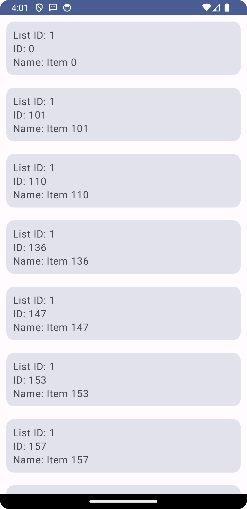

# Fetch Hiring Android App

This is a simple Android application built with Kotlin that retrieves data from the provided URL, processes it, and displays it in a RecyclerView. The data is filtered and sorted based on specific requirements.

## Features

- Retrieves data from `https://fetch-hiring.s3.amazonaws.com/hiring.json`.
- Filters out items where the `name` is blank or null.
- Displays the items grouped by `listId`.
- Sorts the items first by `listId` and then by `name`.
- Displays the processed items in a RecyclerView in a table-like view.

## Dependencies

The project uses the following dependencies:

- Retrofit for HTTP requests
- Gson for JSON parsing
- ListView for displaying the list of items
